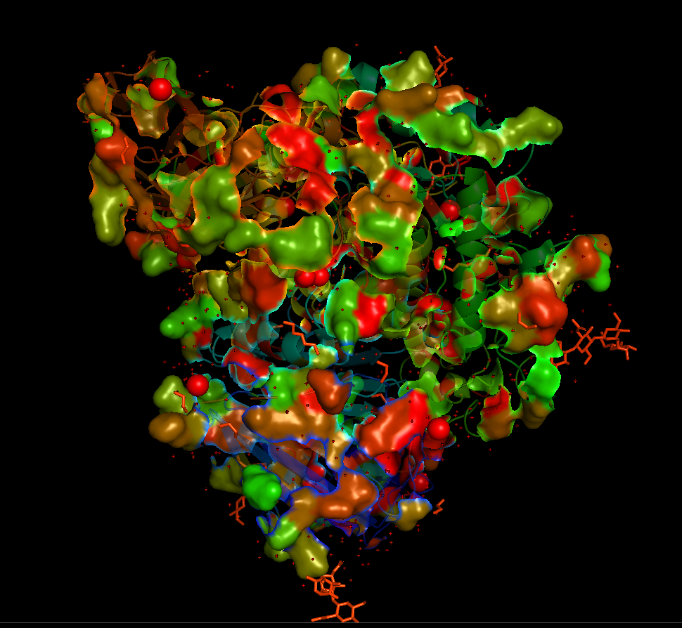

# A demo for GAA Submission evaluation package
```{r, echo=T, results='hide',message=FALSE}
source("../GAA-EVAL.R")
```

## Read in the Experimental data provided by CAGI
```{r, echo=T, results='hide',message=FALSE}
exp.data <- read.RealData(file = "exp_data.csv", sep = ",",
                             col.id = 2, col.value = 5, col.sd = 6)
# inspect the experimental value
head(exp.data$value)
# inspect the experimental sd
head(exp.data$sd)
```

## Read in the submission folders
```{r, echo=T, results='hide',message=FALSE}
sub.data <- read.Submission.Folder(folder.name = "prediction/",col.id = 1,
                                      col.value = 2, col.sd = 3, real.data = exp.data)
head(sub.data$value)
# inspect the dimension
dim(sub.data$value)
```

## ScatterPlot inspection
> Apply the z-score transformation for scatterplot to unify the scale of predicted value

```{r}
plot_all_scatter(real.data = exp.data, pred.data = sub.data, z.transform = TRUE)
```

## Correlation-based Evaluation without/with bootstrap
> without bootstrap
  method = "pearson": In this example, we use pearson correlation
  sd.use = 0.3: experimental value with sd larger than 0.3 is filtered out
  z.transformation does not have effect to pearson correlation
  
```{r}
# 1. Render coefficient value
result.cor.pearson <- eval.Correlation(real.data = exp.data, pred.data = sub.data,
                                       method = "pearson", sd.use = 0.3,z.transform = TRUE)
head(result.cor.pearson)
# 2. Plot Correlation
plot.Correlation(result.cor.pearson, "Pearson")
```

> Bootstrap using row replacement (rep.time = 500 as a fixed input for now)
  boot = T, boot.var = F

```{r}
# 1. Render coefficient value
boot.result.cor.pearson <- eval.Correlation(real.data = exp.data, pred.data = sub.data,
                                       method = "pearson", sd.use = 0.3,z.transform = TRUE,boot = T)
# For Correlation-based Evaluation, provide mean, CI, and median pval
head(boot.result.cor.pearson$summary)
head(boot.result.cor.pearson$rawdat)
boot.result.cor.pearson
# 2. Plot Correlation
plot.Correlation(boot.result.cor.pearson, "Pearson",boot = TRUE)
```

> Bootstrap using distribution modelling (rep.time = 500 as a fixed input for now)
  boot = T, boot.var = T

```{r}
bootvar.result.cor.pearson <- eval.Correlation(real.data = exp.data, pred.data = sub.data,
                                       method = "pearson", sd.use = 0.3,z.transform = TRUE,boot = T,boot.var = T )
head(bootvar.result.cor.pearson)
plot.Correlation(bootvar.result.cor.pearson, "Pearson",boot = TRUE)
```


## RMSD-based Evaluation 
>   - (for demonstration, only present the bootstrapped result)
    - variance.normalization: defined on PPT
    - density.distance: RMSD based on distribution model of experimental value
   
```{r}
# without variance.normalization + without density.distance
boot.result.rmsd4 <- eval.RMSD(real.data = exp.data, pred.data = sub.data,sd.use = NA, 
                      density.distance = FALSE,variance.normalization = FALSE,boot = TRUE)
head(boot.result.rmsd4)
plot.RMSD(boot.result.rmsd4, method="",boot = TRUE)

# with variance.normalization + without density.distance
boot.result.rmsd2 <- eval.RMSD(real.data = exp.data, pred.data = sub.data,sd.use = NA, 
                      density.distance = FALSE,variance.normalization = TRUE,boot = TRUE)
head(boot.result.rmsd2)
plot.RMSD(boot.result.rmsd2, method="",boot = TRUE)

# with variance.normalization + with density.distance
boot.result.rmsd <- eval.RMSD(real.data = exp.data, pred.data = sub.data,sd.use = NA, 
                      density.distance = TRUE, variance.normalization = TRUE, boot = TRUE)
head(boot.result.rmsd)
plot.RMSD(boot.result.rmsd, method="",boot = TRUE)
```

## Cut-off-based Evaluation
   threshold = 0.6: The cutoff for positive/negative value
```{r}
result.auc.0.6 <- eval.AUC(real.data =exp.data, pred.data = sub.data, 
                           threshold = 0.6)
head(result.auc.0.6$results)
plot.AUC(result.auc.0.6)
```

## Between-method Evaluation
```{r}
# for all the submission files
result.bM.spearman <-eval.Correlation.Between(real.data = exp.data, pred.data = sub.data,
                                              method = "spearman",sd.use = NA,z.transform = TRUE)
plot.Correlation.Between(result.bM.spearman$coefficient, method="spearman")


# for best submission of each group
result.bM.pearson <-eval.Correlation.Between(real.data = exp.data, pred.data = sub.data,
                                              method = "pearson",sd.use = NA,z.transform = TRUE,grouped = TRUE)
plot.Correlation.Between(result.bM.pearson$coefficient, method="pearson")
```

## Partial-Correlation Evaluation (controlling the covariates)
```{r}
result.pCor <- eval.Partial.Correlation(real.data = exp.data, pred.data = sub.data, method = "spearman")
plot.Correlation.Between(result.bM.spearman$coefficient, method="Spearman")
```

## PCA Plot
```{r}
total = cbind(real = exp.data$value,sub.data$value)
Plot.PCA(na.omit(total), labels=F, legend=TRUE) 
```

## Uniqueness Evaluation
   uniqueness as adj.r^2 difference between total linear model and linear models without certain group
   use.ci = T : if true error bar as confidence interval; if false, error bar as standard deviation
   
```{r}
# resampling row
result.uniq = eval.uniqueness(real.data = exp.data, pred.data = sub.data,boot = TRUE)
result.uniq
plot.uniqueness(result.uniq, method="", boot = TRUE,use.ci = T)
plot.uniqueness(result.uniq, method="", boot = TRUE,use.ci = F)
# generating from experimental distribution
result.bootvar.uniq = eval.uniqueness(real.data = exp.data, pred.data = sub.data,boot = TRUE,boot.var = T)
result.bootvar.uniq
plot.uniqueness(result.bootvar.uniq, method="",boot = TRUE,use.ci = F)
```

## CAGI-Pymol

```{r}
res = eval.correctness(real.data = exp.data, pred.data = sub.data,threshold = 0.5,sd.use = NA,lower.positive = F,z.transform = F,"5nn3")
head(res)

TukeyHSD()
```
> Then load cagi_plot.py module into pymol and call plot_cagi function
  `PlotCorrectness(prot_name,path)` The function output a .pse file for the protein
  Red: correctness closer to 100%
  Green: correctness towards 0%
  

```{r}
chocolate = data.frame(
  Sabor =
  c(5, 7, 3,
    4, 2, 6,
    5, 3, 6,
    5, 6, 0,
    7, 4, 0,
    7, 7, 0,
    6, 6, 0,
    4, 6, 1,
    6, 4, 0,
    7, 7, 0,
    2, 4, 0,
    5, 7, 4,
    7, 5, 0,
    4, 5, 0,
    6, 6, 3
  ),
Tipo = factor(rep(c("A", "B", "C"), 15)),
Provador = factor(rep(1:15, rep(3, 15))))
tapply(chocolate$Sabor, chocolate$Tipo, mean)
ajuste <- lm(chocolate$Sabor ~ chocolate$Tipo + chocolate$Provador)
anova(ajuste)
```
